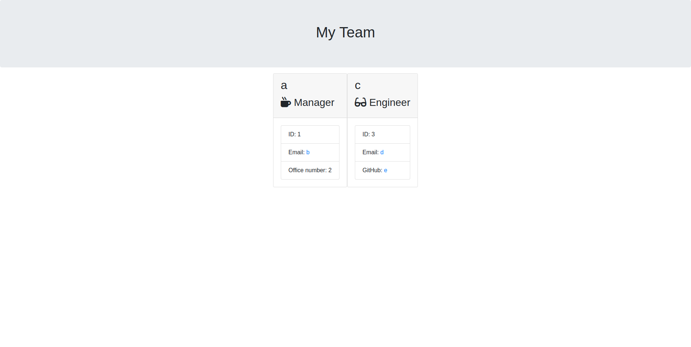

# Team Builder



My solution for the edX front-end Module 12 challenge. It's a HTML builder that uses input from inquirer.

## Installation
First, clone the repository and cd into it.
```bash
git clone https://github.com/iy2k22/team-builder.git
cd team-builder
```
Then, install all the dependencies.
```bash
npm install
```
## Usage
Run the script with:
```bash
node index.js
```
If everything goes well, the result will be in `output/team.html`.

## Credits
* [Bootstrap](https://getbootstrap.com)
* [Inquirer.js](https://github.com/SBoudrias/Inquirer.js)